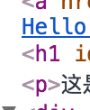

## subtitle

hello *there*
  * w
  * x
  * y
  * z

hi
hi


hi
hi

## node
```node
function () {
  return 1; // what?
}

  import axios from 'axios'
  import marked from 'marked'
  import {highlightAuto} from 'highlight.js'
//  import 'highlight.js/styles/github-gist.css'
//  import 'highlight.js/styles/paraiso-light.css'
  import 'highlight.js/styles/vs2015.css'

  marked.setOptions({
    highlight: function (code) {
      return highlightAuto(code).value
    }
  })

export default {
  components: {},
//    computed: {
//        imgUri () {
//            return `/static/markdown/${this.path.slice(0, -3)}.png`
//        }
//    },
  data () {
    return {
      path: '',
      md: '',
      mhtml: `<div class="loading" style="font-size: 21px">正在加载文章...</div>`,
      title: '',
      imgPreview: {
        url: '',
        ratio: 1
      },
      linkPreview: '',
      window: {
        width: 0,
        height: 0,
        ratio: 1
      }
    }
  },
  watch: {
    'imgPreview.url' (val) {
      document.body.style.overflow = val ? 'hidden' : ''
    },
    linkPreview (val) {
      document.body.style.overflow = val ? 'hidden' : ''
    }
  },
  computed: {
    imgPreviewStyle () {
      const scr = this.window.ratio
      return this.imgPreview.ratio > scr ? {
        width: '80%'
      } : {
        height: this.window.height * 0.8 + 'px'
      }
    }
  },
  created () {
    this.path = this.$route.params.path
    this.title = this.path.split('/').pop().slice(0, -3)
    axios(`/static/markdown/${this.path}`).then(res => {
      this.md = res.data
      this.md = this.md.replace(/(\[.*?\]\()((?!http).+\))/g, `$1/static/markdown/${this.path}/../$2`)
      this.mhtml = marked(this.md)

      while (1) {
        const re = /<pre><code.*?>[\s\S]*?<\/code><\/pre>/
        let code = this.mhtml.match(re)
        if (code) {
          code = code[0]
            .replace(/<code(.*?)>/, '<_code$1><div>')
            .replace(/\n<\/code>/, '</div></_code>')
            .replace(/\n/g, '</div><div>')
          console.log(code)
          this.mhtml = this.mhtml.replace(re, code)
        } else break
      }

      this.mhtml = this.mhtml.replace(/_code/g, 'code')
    })
  },
  mounted () {
    this.window.width = window.innerWidth
    this.window.height = window.innerHeight
    this.window.ratio = window.innerWidth / (window.innerHeight + 0.01)

    this.$refs.md.onclick = e => {
      const t = e.target
      if (t.tagName === 'IMG') {
        this.imgPreview.url = t.getAttribute('src')
        const {width, height} = t.getBoundingClientRect()
        console.log(width, height)
        this.imgPreview.ratio = width / (height + 0.01)
      }
      if (t.tagName === 'A') {
        e.preventDefault()
        this.linkPreview = t.getAttribute('href')
      }
    }
  }
}
```
# title

## c++
```c++
#include <iostream>
using namespace std;
int main () {
  cout << "hello world";
  cout << "hello world" << "hello world" << "hello world" << "hello world" << "hello world" << "hello world" << "hello world" << "hello world" << "hello world" << "hello world";
  cout << "1234567890123456789012345678901234567890123456789012345678901234567890123456789012345678901234567890123456789012345678901234567890";
  return 0
}
```

请使用快捷键`⌘1`、`⌘2`和`⌘3`在三窗格（文库、文稿列表和编辑器）、两窗格（文稿列表和编辑器）和仅编辑器视图之间切换。您还可以最左侧的工具栏按钮切换视图。


>what is this

## image



## link
1. [here](scr.png)
2. [百度](https://www.baidu.com)
3. [哔哩哔哩动画](https://www.bilibili.com)
4. [海外站](https://www.webnovel.com)
5. [百度搜索](https://www.baidu.com/s?ie=utf-8&f=8&rsv_bp=1&rsv_idx=1&tn=baidu&wd=window.scrollTo&oq=scss%2520media&rsv_pq=f173df2800000244&rsv_t=a5f1oqa0saaM%2FvqQSE%2FFzKILI2QLY%2BydYOHaJycFZ4SgnH7xSfI7zWMVMuo&rqlang=cn&rsv_enter=1&inputT=435&rsv_sug3=10&rsv_sug2=0&rsv_sug4=461)
