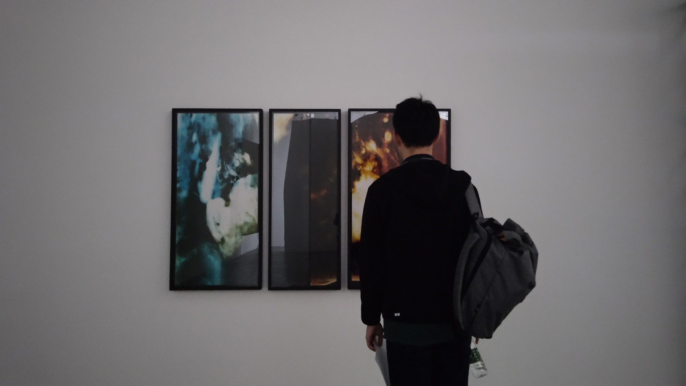
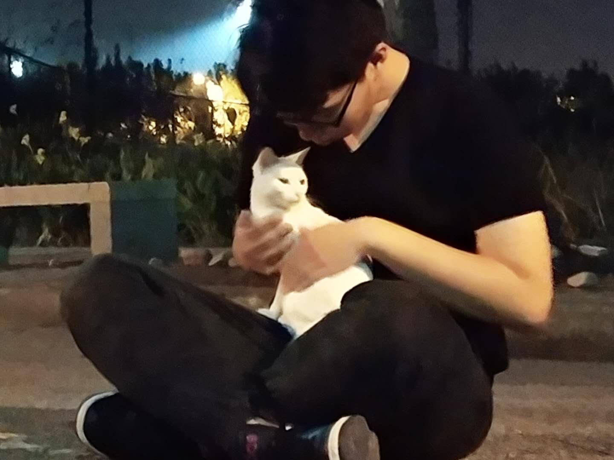

子时，睡不着觉。躺下又爬起来。战战兢兢，好像思路散在书桌上，需在零落前收起来。

熬夜有害身体，知道，明镜一样。不睡，心力交瘁；睡下，心中惴惴。很多事情想做，太多事情想做；眼前的杂事却一件接一件，像节假日的游客一般向我涌来。相比之下，总被许多无谓的作业牵连，反不如公司的技术氛围浓厚。

去公司实习两个月，技术方面长进不大，不过着实开阔眼界。原生`CSS`和`JavaScript`，其知识点如此繁复零碎；张老师能了如指掌，见他才见泰山。又浅尝设计模式，忽然觉得自己一叶障目。设计代码比上不足，实现页面也才初窥门径，如果偏执于表现与交互，难道半路出家，做个业余美工？

从前自诩做了许多项目，列入简历也着实不少：有骇客松的项目、有得意的作业、有外包或平日的零碎练手。开发完成，匆匆交付，从此不闻不问。没有反馈，没有优化，没有跟进，没有沉淀。做泥胎的本领一天天见长，却到此为止。长此以往，其他本领也生疏，精巧的算法也渐远。世界大得很，我却忙着雕刻一些粗陋不堪的玩偶，甚至忙得颠三倒四，迷了归途。

颠三倒四，浑浑噩噩。我的思维像患了阿兹海默症。曾经，词句如歌，代码如诗，慧眼如炬，他们都远去了。问，我的大脑，这是由于疲劳还是饥馑呢？

或许应当归咎于短文字太多，读一长段话都觉得头疼；渐渐，长的技术文章也沉不下气读，长的散文也静不下心赏。能用几个小时的零碎时间去刷知乎豆瓣微信空间哔哩哔哩，却拿不出一刻钟认真翻几页书。心浮气躁，世界上噪音格外多，读书就成了一件奢侈的事情。想读页书，还需得天时地利人和，缺失一点就静不下心，读不进书。没有妙笔，再难生花。

在文化的荒漠里干渴了太久，牙尖嘴利，腹中空空；我有自知之明。

看书，看展，听音乐会。醉心细腻工巧的白描恍惚一阵，沉迷色块颜料的融合恍惚一阵，陷入和声织成的帷幔恍惚一阵。下课路上不急着回，猫垂手可得：天鹅一样的猫，狐狸一样的猫。

心乐之。只可惜，自经丧乱，长夜沾湿，身不由己。

思语劝我别熬夜，说小心变老。我说，老了好呀，老来多健忘。

思语立刻回，不忘。

