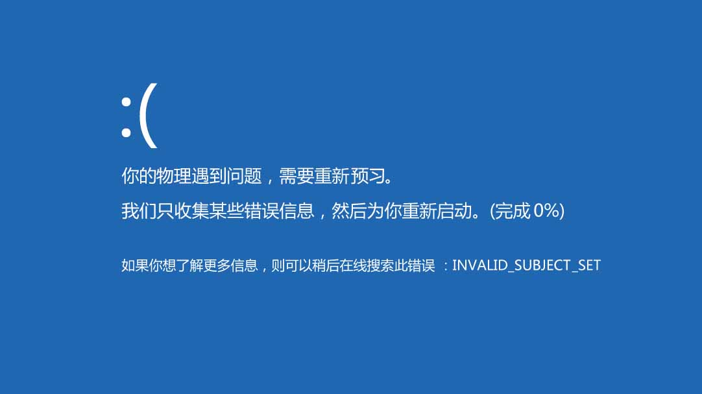

再过几个小时天亮，再过几个小时是物理考试。去洗把脸，仪式性地翻看崭新的物理书，妄图做垂死挣扎。手指像强迫症患者一样捻着书页的边缘，仿佛燧人氏钻木取火，即将搓出物理学智慧的火花；或者也许只搓卷书页一角。低下头，脸用力凑向桌子，同文字序列们问好。毫无规则，鳞次栉比，似曾相识。

矢量场…电偶极子…场强叠加…

唔，所以这部分还是跟电有关系。电荷，电路，芯片…所以这就是为什么软件工程的学生要学习大学物理。毕竟你们要熟悉带电的这一套理论，才能从根本上学习一个，才能写出纯正的代码来。只会写代码找不到女朋友，但是倘若你在写代码时，突然蹦出一句“高斯环路定理”，就显得你的代码特别血统纯正。纯正血统的代码最有魅力，能一下就抓程序媛的目光。就像，嗯，让判卷老师一下就看到你的卷子，然后就会给你高分。

对对对，高考前老师总是这么说，判卷人一眼能看到字迹好看的卷子；同学们要好好写字，谁有时间看你的作文。学生某某大胆实验，证明给分的确如此，诸生遂一哄而起。去买钢笔，去买墨水，去校门口的书店抢购字帖。描了许多页，字还是没变，于是作罢。然而字帖荒废一旁，最终在毕业后卖给校门口收书本的阿姨。阿姨站在小车前，想着学生的钱最好赚，几十块钱的新书几块就卖，倒一下又是一本好书。于是对车上的物理书殷切地笑，对路过的学生殷切地笑。收拾书本离校的学生络绎不绝，熙熙攘攘，仿佛看到三潭映月，五岳独尊，人民大会堂，崭新的，褶皱的，堆叠在一起，一拥而上，塞进腰包里。

这些人，一结课就卖书，毫不留情啊毫不留情，像秋风扫落叶，管它学了什么知识，都不如卖书来钱。就像我的大学物理书，明天考完试就卖掉，不知道能弄几块。还是攒起来，毕业一起卖。

嗯，当时高中毕业好像卖了不少书，或者一本都没有卖，只是毕业后习惯性地在校门口转，进去又无事可做，只好站在一旁围观。收书本的阿姨把书一摞摞堆在一起，往车上一滚。谁管你是学霸还是学渣，毕业了就这么几张纸，什么也留不下。只有状元等等的名字，拿红纸版写了立在校门前，风吹日晒。于是校门前总是摆着类似英雄榜的东西，仿佛贵校只收了这么几个分高的，其余学生杳无音讯。谁记得，曾几何时，同窗来来去去，三三两两跨过校门。也许挟着一本书，也许提着半壶水，欢声笑语去买校门口的煎饼。

不光有煎饼，还有奶茶和炸鸡排。谁能想到，后来会去同济食堂附属大学，后门黑料小吃一条街，校园里面还开大排档，饭点总排十几米长队。等待的人低头刷手机，短裙热裤绰绰约约，埋在爆炒的油烟里。随长队移动半个小时，端回堆积如山的小龙虾。小龙虾的壳渍满辣子，红彤彤，映射出学生油光锃亮的手和嘴。不听见网上那些评论骂得么?说现在的大学生不好好学习，每天浪费钱搞这享受，难怪最后期末都挂科。都挂科，给五十九分不给过，难忘师生情。得让这群不好好学习的知道：马列毛邓三，除了客观性，还有可挂性，看你怕不怕。

怕怕怕，不能挂科，不能挂科。瞎想啥，赶紧看物理，一个小时又过去。什么一维无限深势阱，这些字应该记着，将来做物理引擎的时候，计算要用。快，看书，同学。我爱物理，物理使我进步。

现在不正流行这句话，我爱xx，xx使我进步。睡觉，物理，cocos，还有重命名为学习的守望先锋快捷方式，都可以往空里填。说得好像我不知道什么让我进步，我看每天写代码最进步。屏幕上闪动一排排指令，远比公式概念可爱得多。

何止可爱，输入任务栏俨然街角闪烁的粉色霓虹灯，充满暧昧的气息。打开电脑，开间文件夹，选一个漂亮标致的源码。光标划过换行凹凸有致的程序，带领程序员走向那一片不可描述的STL库。小程序员哪见过这些漂亮的代码，手指禁不住大力在键盘上敲打，在白花花的vim上留下自己的印痕。然而写不了多少，很快就缴枪编译，然后不知道哪里错误。Warnings，Errors，太危险，放弃信仰去开VS。VS要更新，预计时间四个小时。晾在一旁。Cpp复杂又高冷，锋利的STL，让多少心肠破碎。还是我的Python妹妹又萌又可爱，约会还有语法糖吃。

来来来，开Python，虽然学校根本不讲。这么好的语言怎么不讲？就不讲就不讲，我就是把时间安排大物行政也不给你。来，我们先来一本谭浩强的C入个门，加一点同济大学高等数学提味。学了线性代数还不转专业？难道老师已经透露给你，这些东西后面图像处理会用？他怎么能剧透呢！一点都不surprise。晕头转向上理论，书到用时方惊喜。反正你得重学，提前保留一点人生的乐趣。

然后许多同学都吓得没了兴致。不转专业的都是真爱。爱代码，爱程序，不爱睡眠。凌晨三点，往常都在写代码，那才是真正的快乐，看数据结构不能自拔好嘛。凌晨四点的上海，还在淅淅沥沥滴雨。寝室，漆黑侵染身后的一切。屏幕的亮光，路灯的侧光，散落在《算法导论》封面；键轴的起伏，窗外的雨声，混在一起比音乐好听。流行歌太炸，或者腻腻歪歪，让人静不下来，毁了夜晚写代码的氛围。安安静静地，一句话都不说，这是最好的，这样才能再学习一个，才能提高自己的知识水平。

噫，我什么时候开始写代码的，还弄了个组件出来。简直有毒，看书看书。你会这些又不考，代码能力强也没人看，人家钻红了眼只看G点，绩点，GPA，管它有几个叫法，反正都没有。都——没有。Major in, dedicate in, who cares? 刚进大学的时候谁知道会有这种坑。

谁没当过几年尖子生？“我知道这门课没用啦，但是你可以证明自己的能力。”那个证明能力的考试去年已经通过了好不啦，大学还要证明，我证明给谁看。每次上课老师都念PPT，坚持以真理说服人，我证明给他看么？同班同学不相往来，同学一场落得白首如新，我证明给他看么？于是就挂吧，把你的时光和精力，把你的青春与创造，揉成团，撕成片，扔进墙角的垃圾桶。当毕业回首往事的时候，尽管不会因为虚度年华而悔恨，也不会因为碌碌无为而羞耻；却实在没有收获什么东西，麻木且茫然，于是毕业证书拿来当饭吃。是这样的么？

不行，不行。不能挂。挂了就没有写代码的时间。等后面人家做项目的时候你还得重修，怎么写得出作品。然而时光不会在漂亮的项目上眷顾1s，成绩也不会。大家都是一样的分数，费那么大劲不如一起玩啦*仔。看物理，学物理，我有知识我自豪。要把写代码的劲头放在这些学科上，才有好前途。

快看书，两个小时还没翻页。窗外的雨声响起来了，雨滴敲在地上噼啪作响。喝水，点灯；崭新的书第一次摊开，小程序员迎接他的命运。